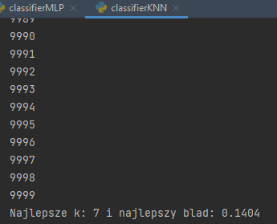
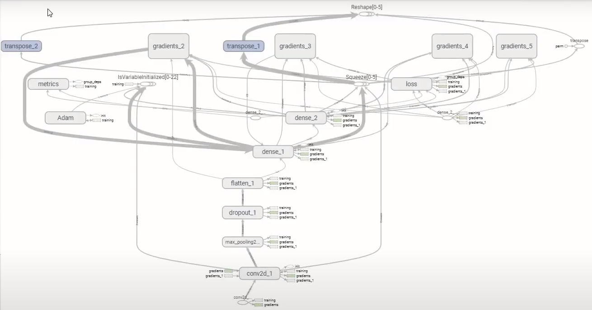
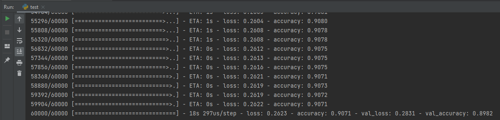
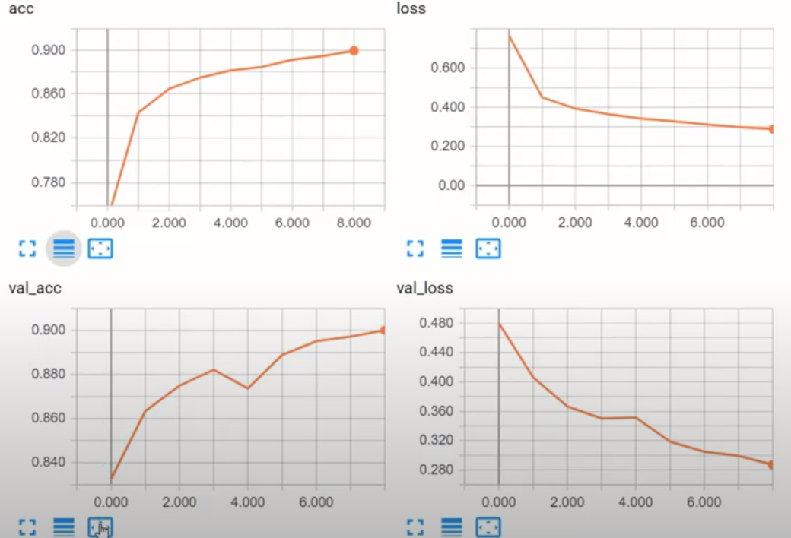

# msid-4
Metody Systemowe i Decyzyjne zadanie 4

##Fashion-MNIST - Introduction The clue of the task is to implement a model that allows classification of thumbnails of photos representing clothes from Fashion-MNIST. Fashion-MNIST is a dataset of Zalando's article images-consisting of a training set of 60,000 examples and a test set of 10,000 examples. Each example is a 28x28 grayscale image, associated with a label from 10 classes.

Here we have an example of how the data looks:

##KNN

#First classifier we'll be covering is KNN (k-nearest neighbours). The Distance Metric I decided to use is Manhattan Distance. The KNN algorithm assumes that similar things exist in close proximity. K parameter represents number of neighbours we take into consideration.

# How model looks like

##Conv2D
Keras Conv2D is a 2D Convolution Layer, this layer creates a convolution kernel that is wind with layers input which helps produce a tensor of outputs.

Imagine we have an image that is an 2D array of 5x5 pixels. The idea of a Convolutional Layer is to essentially create another grid of layers known as the kernel or filter. So for example we have an 5x5 image and 3x3 kernel to filter the image. Convolution is an operation of multiplying corresponding kernel and pixels values, summing them up and passing to another array of pixels.

##MaxPooling2D
Downsamples the input along its spatial dimensions (height and width) by taking the maximum value over an input window (of size defined by pool_size) for each channel of the input. The window is shifted by strides along each dimension.

##Dropout

Then we got Dropout which is a computationally cheap way to regularize our neural network. It's a technique where randomly selected neurons are ignored during training

##Dense 

The dense layer is a neural network layer that is connected deeply, which means each neuron in the dense layer receives input from all neurons of its previous layer. The values used in the matrix are actually parameters that can be trained and updated with the help of backpropagation.The output generated by the dense layer is an ‘m’ dimensional vector. Thus, dense layer is basically used for changing the dimensions of the vector.

##Compiling the model

Loss function — An algorithm for measuring how far the model’s outputs are from the desired output. Categorical crossentropy is a loss function that is used for single label categorization. This is when only one category is applicable for each data point so it exactly fits the problem.
Optimizer — An algorithm for adjusting the inner parameters of the model to minimize loss. Adam optimization is a stochastic gradient descent method that is based on adaptive estimation of first-order and second-order moments. Unlike stochastic gradient descent, adam changes learning rate during training.
Metrics — A metric is a function that is used to judge the performance of the model. Metric function is similar to loss functions, except that the results from evaluating a metric are not used when training the model. The following example uses accuracy, the fraction of the images that are correctly classified

##My Results

We are training the model in 10 epochs, using 512 sized batches. Batch size describes number of samples per gradient update.

After training the model and broken down into validation data, we obtained the following results:

KNN: k-nearest neighbours - 7 with 85,96% accuracy

cnn_model with 89,82% accuracy on validation data
